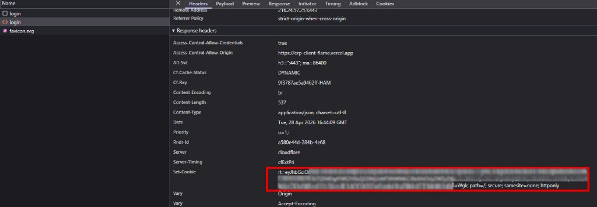

# Authentication (SPA)

Sign-in is split the usual way for a React app talking to a separate API: the access token lives in memory on the client, and a separate refresh token is kept in a cookie the JavaScript cannot read.

When you log in with email and password, the API answers with JSON that includes the JWT, and it also tells the browser to store a cookie called `rt` on the API host (for example on Render), not on the Vercel URL. That is why you will not see auth cookies if you only look at storage for the frontend domain. The screenshot below is a real `POST /api/Account/login` response: the important line is `Set-Cookie` for `rt`, with HttpOnly and SameSite=None so cross-site requests from the deployed client can still carry credentials. Blur the actual cookie value if you share this anywhere.

After that, normal API calls use `Authorization: Bearer` with whatever JWT Axios is holding. If you reload the page and the in-memory token is gone, the app hits `/api/Account/refresh`; the browser sends the `rt` cookie along, and you get a new access token without typing your password again. Logout calls the API so the server clears that cookie.

To inspect things in Chrome, use Fetch/XHR in the Network tab and pick the POST to `/api/Account/login` on the API host—not the `/login` page load from Vercel, which is just HTML. For cookies under Application, select the API origin in the Cookies list.

Relevant files: cookie and login endpoints in `ERP-api/Controllers/AccountController.cs`, token creation in `ERP-api/Helpers/JwtTokenHelper.cs`, Axios and the 401 refresh logic in `ERP-client/src/lib/axios.ts`, and initial session hydrate in `ERP-client/src/auth/AuthProvider.tsx`. CORS for allowed origins is configured on the API so credentialed requests from the client are permitted.

