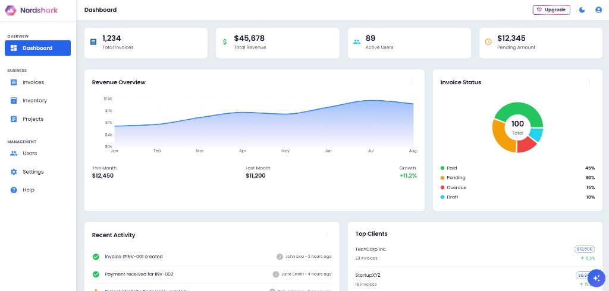

# ERP monorepo

**Demo:** [https://erp-client-flame.vercel.app](https://erp-client-flame.vercel.app)

A **business system dashboard**: **backend API** (ASP.NET Core) and **web client** (React + Vite).

**AI-assisted development:** [Claude](https://www.anthropic.com/claude) (including **Claude Code** in the editor) was used for much of the **backend** work in `ERP-api`—API controllers, EF Core models and migrations, demo seeding, and related C#—while the React client and UX were built with a mix of other tooling and manual work.

## Production vs local

- **Production (deployed):** Push to the branch your host uses (for example `main`). The **Vercel** build publishes the client; **Render** (or your host) runs the API with `ASPNETCORE_ENVIRONMENT=Production`. Base `appsettings.json` sets **`Seeding:EnsureLocalDemoTenant` to false**, so the API does **not** create a demo company or users on startup. New tenants and admins are created like a real product: **`POST /companies/register`** (or the app’s **Register** screen), then sign in. **JSON** endpoints use routes such as `GET /invoices`; the client uses `VITE_API_BASE_URL` (or the default in `ERP-client/src/config`) as the API **origin** and calls paths like `/invoices` from there. **Redeploy the API** after you add new controllers so production stays in sync. Keep secrets in platform environment variables, not in the repository.

- **Local (full stack):** Run PostgreSQL (often via `ERP-api/docker-compose.dev.yml`), the API in Development (`dotnet run` in `ERP-api`), and the client (`npm run dev` in `ERP-client`). With **`appsettings.Development.json`**, you can enable **`Seeding:EnsureLocalDemoTenant`** so the first run creates the demo company and admin using the **same** code path as **`POST /companies/register`** (same `Company`, `ApplicationUser`, and **Admin** role as a self-registered tenant). Demo inventory/projects/invoices follow when **`Seeding:LoadDemoDataWhenTenantExists`** is true. Prefer [user secrets](https://learn.microsoft.com/en-us/aspnet/core/security/app-secrets) or env vars for passwords. Do not enable local-only seeding flags in production.

## Nordshark business system

The web client is a light themed **Nordshark** admin UI with left navigation, headline KPIs (invoices, revenue, users, pending amounts), a revenue trend chart, invoice status breakdown, recent activity, and top clients: typical ERP style monitoring in one view.

## Docker (optional local stack)

You can run database services and the API with Docker Desktop using the compose file under the API project. A typical setup includes a **PostgreSQL** container (development data), an **optional pgAdmin** instance for browsing the DB, and the **API** container, all grouped under one compose project, as shown below.

This is only a **local tooling** view: resource usage and port bindings are environment specific and do not reflect production. No secrets belong in screenshots; keep API keys and connection strings out of the repo (use `.env` / user secrets, never commit real credentials).

## Local development (step by step)

1. **Database** — From `ERP-api`, e.g. `docker compose -f docker-compose.dev.yml up -d db`. Make `ConnectionStrings:DefaultConnection` in `appsettings.Development.json` (or `ConnectionStrings__DefaultConnection` in the environment) use the same **host port** and **database name** as the container.
2. **API** — `cd ERP-api` → `dotnet run` → `http://localhost:8080` (Swagger: `/swagger` in Development).
3. **Client** — `cd ERP-client` → `npm install` → `npm run dev` → open the printed dev URL; it calls the API from `ERP-client/src/config` (override with `VITE_API_BASE_URL` for a remote API). First local API start can seed the demo **tenant and demo data** as described in **Production vs local** (Development only, driven by `Seeding` in `appsettings.Development.json`).
