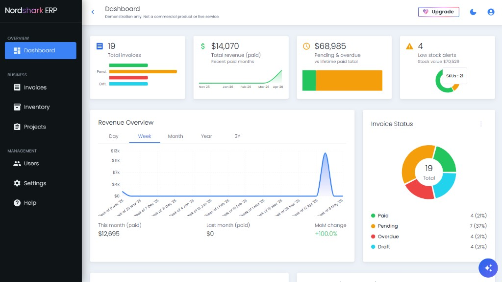
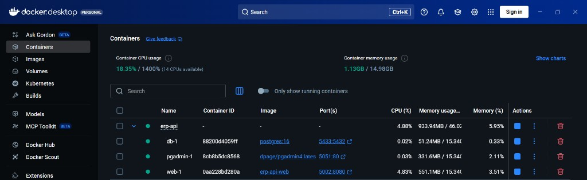

# ERP monorepo

This is a hobby ERP style dashboard, not something I sell or support. The repo has been torn down and put back together more than once, and it moved from GitLab to GitHub along the way. I used coding assistants a lot, especially Claude and editor tooling, for much of the C# side in the backend dotnet project while the React client was a mix of manual work and other tools.

## How it works at a high level

You have two moving parts. The API is ASP.NET Core with Entity Framework Core and PostgreSQL. It serves JSON under the /api prefix. Identity handles users, roles, and claims, and most business tables carry a company id so one install can hold many tenants without mixing their rows. The web app is React with Vite, TanStack Router and Query, Material UI, and a small axios layer that sends a bearer token and uses an HttpOnly refresh cookie and tells axios to send credentials on cross origin requests so the browser can renew the session when the access token expires.

Self serve registration is not possible in this build. The Register screen and related UX are not something you can rely on yet. Google auth exists in the API in a partial form but is not fully implemented end to end, so treat password login as the path that actually matches how refresh and cookies were tested. In production the API applies migrations and seeds Identity roles on startup; it does not invent demo companies or demo invoices for you. You still need a real user in the database before the app is useful, whether that came from an older setup, manual inserts, or a one off API call you make yourself. Locally, after a user exists, you can use the guest seed scripts from the scripts folder in the React project if you want fake projects and invoices.

The deployed demo client lives on Vercel while the API can sit on Render or another host. That means the browser origin for the UI is not the same as the API origin, which matters for CORS and cookies.

## Stuff that broke in real hosting and what I did about it

The client build needs the right API address baked in at compile time. Vite only sees variables prefixed with VITE_. I pointed production builds at the real API using VITE_API_BASE_URL and kept a small config helper under src/config in the React app so a trailing slash or forgetting the /api segment does not leave you calling the wrong path. When the dashboard looked fine locally but every fetch failed in prod, the culprit was almost always that base URL or the client still serving an old bundle; redeploying the client after an env change fixed the second case.

Cookies and cross site logins were the other recurring headache. The refresh token lives in an HttpOnly cookie. For a SPA on Vercel talking to an API on another domain you need CORS to allow the real origin, allow credentials, and you need the cookie flags to match how the browser will send it. I aligned allowed origins in the API config with the deployed site, used SameSite None with Secure for that cross site setup, and made sure the client axios instance always sent credentials on axios calls so refresh requests actually carried the cookie. When login worked in Development on localhost but refresh failed against production, tracing those three pieces usually ended the hunt.

Database surprises were mostly connection strings and migrations. On Render the host and port are not localhost, and the password lives in an environment variable, not in a checked in json file. If the API booted but every request errored, or startup failed, I compared the connection string to what the host actually provides and checked that migrations had run. Locally I often use the compose file in the backend project to run Postgres and pgAdmin, then point ConnectionStrings:DefaultConnection at that container.

Demo and seed data was a policy choice rather than a bug. I did not want the production API to silently insert Nordshark demo rows for every deploy, so seeding stays in scripts you run on purpose from the React project when you need a believable inventory for screenshots or testing.

## What you see in the Nordshark UI

The client is a light admin shell: left navigation, KPI style cards for invoices and revenue and users and pending amounts, a revenue trend chart, invoice status mix, recent activity, and top clients. It is the usual “one screen to feel the health of the business” idea rather than a finished product for a paying customer.

## Docker on your machine

Docker Desktop can run Postgres, optional pgAdmin, and optionally the API from the compose project in the API folder. The screenshot is only what my machine looked like; your ports and resource usage will differ.

Do not put secrets in screenshots or in git. Use platform env vars on the host, user secrets or local env files on your laptop, and never commit real credentials.

## Running everything locally

1. Start Postgres. From the backend dotnet project folder, bring up the database service using the development Docker Compose yaml (the one that names docker, compose, and dev together in the filename). Set ConnectionStrings:DefaultConnection in appsettings.Development.json, or ConnectionStrings__DefaultConnection in the environment, to match the container host, port, and database name.

2. Run the API. In that same backend folder run dotnet run. In Development you get Swagger at /swagger and the API listens on the port you configured (for example port 8080).

3. Run the client. In the React project folder run npm install then npm run dev. Open the URL Vite prints. The client reads its API root from src/config unless you override with VITE_API_BASE_URL. If the database is empty, you have to bootstrap your first company and admin outside the Register flow, since that flow is not available yet. Optional demo data: use the guest seed npm script documented in the React package when you already have a user.

Pushing main (or whatever branch your host tracks) updates Vercel for the client and your API host separately. If you add API endpoints, redeploy the API so production picks them up. Keep JWT keys and database passwords in the host environment, never in the repository. Google client secrets only matter if you are experimenting with Google sign in, which is still incomplete.

This project is for learning how deploys, env vars, auth, and databases behave outside your laptop. It is not a promise that the design is ready for regulated data or heavy production load.
